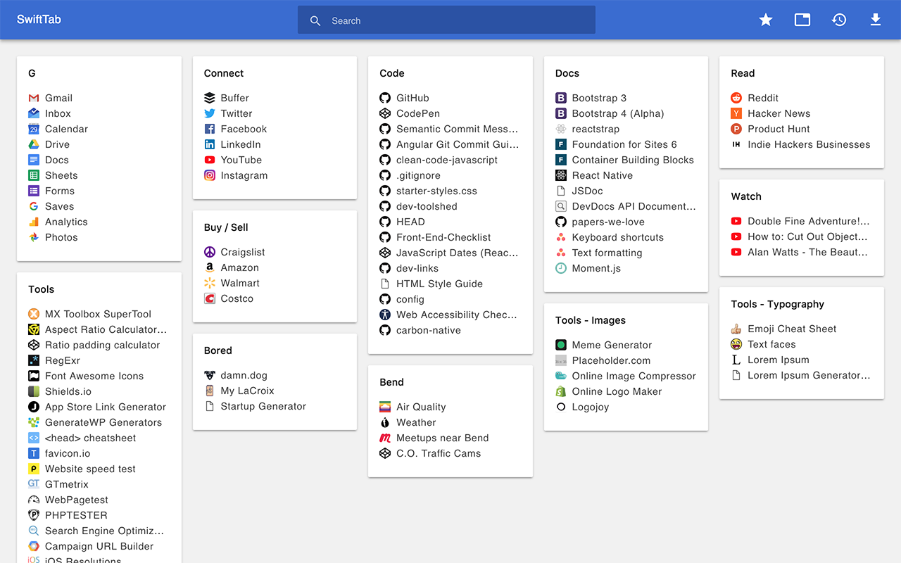

# SwiftTab

Chrome extension that enables a personal new tab page featuring links from your Bookmarks Bar

  

**[Available on the Chrome Web Store](https://chrome.google.com/webstore/detail/swifttab/poikmgendcdljfoaelblkdjehmpedjif)**

## Screenshot

## Manual Install

- Clone or download this repo
- Install Dependencies: `yarn` or `npm install`
- Build Extension: `yarn build` or `npm run build`
- Load Extension:
  - Launch Chrome
  - Browse to `chrome://extensions`
  - Check "Developer mode" if it isn't already checked
  - Press "Load unpacked extension..."
  - Select the `build` folder

### Troubleshooting

#### The new tab page is blank

- Don't forget to install dependencies & build the extension
- Don't forget to select the `build` folder and not the `public` folder when loading the extension

## To Do

- [ ] Config new default icon for bookmarks without favicons
- [ ] Re-architect
  - [ ] Remove build step?
    - I learned that babel standalone won't work inside a chrome extension (new tab)
      - CHALLENGE ACCEPTED — I'm going to get this to work
  - [ ] Create BookmarksProvider
- [ ] Define PropTypes
- [ ] Remove inline styles (AppToolbar, ?)
- [ ] Refactor (Reconsider component hierarchy?)
- [ ] Update to Manifest v3
  - [ ] Update `manifest.json`
    - [ ] Update value of `manifest_version` from `2` to `3`
    - [ ] Change permissions value from `favicon` to `chrome://favicon`
  - [ ] Update `BookmarksView.js`
    - [ ] Add `/*global chrome*/` to top of file (first line)
    - [ ] Uncomment new favicon url formats in `getImageString`
- [x] Add Support for Firefox

## License

[MIT](LICENSE)
